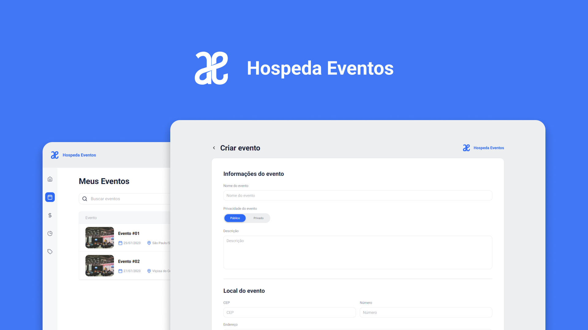

<h1 align="center">
  
</h1>

<h3 align="center">
  Hospeda Eventos 📅
</h3>

<p align="center">Portal para gerenciar (criar, atualizar ou excluir) eventos públicos ou privados</p>

<p align="center">

<a href="https://www.linkedin.com/in/matheralvs/" target="_blank" rel="noopener noreferrer">

</a>
<a href="https://github.com/matheralvs/hospeda-eventos/commits/main">

</a>
<a href="https://github.com/matheralvs/hospeda-eventos/issues">

</a>
</p>

<p align="center">
<a href="#-sobre-o-projeto">Sobre o projeto</a> •
<a href="#-tecnologias">Tecnologias</a> •
<a href="#-como-começar">Como começar</a> •
</p>

## ✅ Sobre o projeto

Este projeto é parte de um desafio para vaga de estágio como desenvolvedor. A proposta consistia em criar uma aplicação estilo dashboard, para administrar eventos públicos e privados.

## 🚀 Tecnologias

Tecnologias que usei para desenvolver a aplicação:

- [ReactJS](https://pt-br.reactjs.org/)

- [NextJS](https://nextjs.org/docs)

- [TypeScript](https://www.typescriptlang.org/)

- [TailwindCSS](https://tailwindcss.com/)

- [ViaCEP](https://viacep.com.br/)

## 💻 Como começar

**Clone o projeto e acesse a pasta:**

```bash

$ git clone https://github.com/matheralvs/hospeda-eventos.git && cd hospeda-eventos

```

**Siga os seguintes passos:**

```bash
# Install the dependencies

$ npm i

# Rename env.example for to .env.local and choose best api host for you. I left localhost:3333 as default.

# To finish, run

$ npm run dev

# Well done, project is started!
```

Made with :purple_heart: by Matheus Alves 🤝 [See my linkedin](https://www.linkedin.com/in/matheralvs/)
